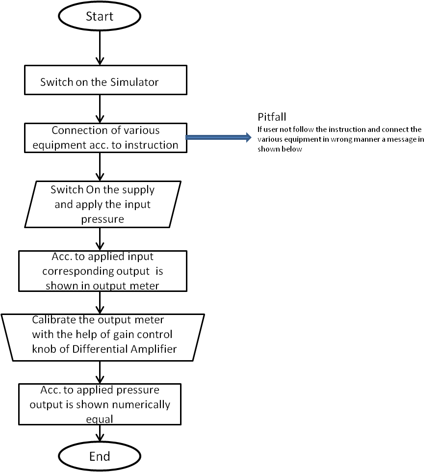
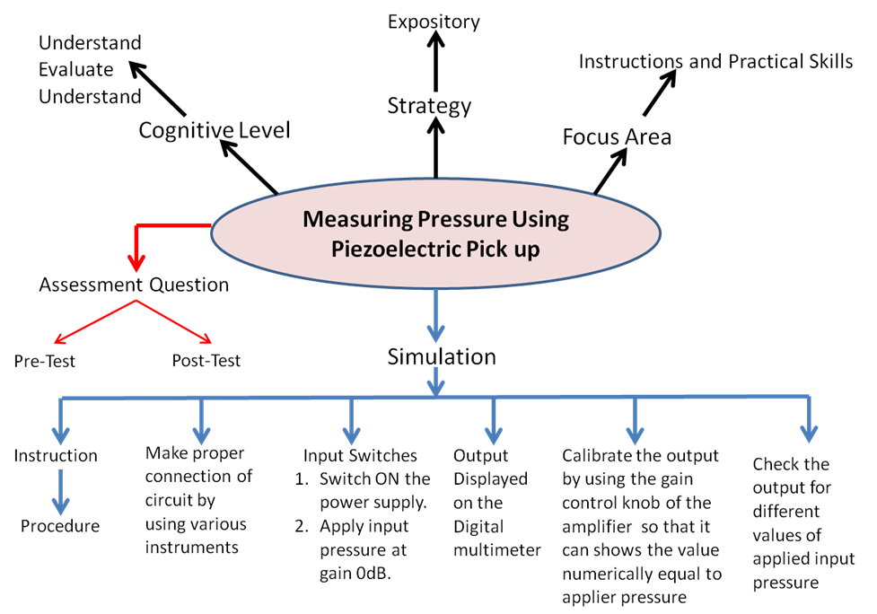

## Storyboard (Round 2)

Delete this line before submission : The core principle of Round 2 is to make the lab/experiment documentation elaborated in a manner that it makes easy for any person (developer/domain and non domain faculty/student) to understand and develop the lab/experiment.

Experiment 1: Name of the Experiment

### 1. Story Outline:

Describe outline Here ( guide : The proposer should first draft the story outline for the proposed outline. This could be 2 or 3 paragraphs.)

### 2. Story:
Experiment 1: Measuring Pressure
Using Piezoelectric Pick up.

 

1.Story Outline:
 

This
experiment is based on how to measure pressure applied at piezoelectric
transducer with the help of differential amplifier and digital meter by calibrating
the gain control knob of amplifier.

 
Firstly 
the user will make the proper connection of the piezoelectric transducer,
differential amplifier and digital meter. After that apply the pressure by
selecting the different values shown in the input to be measured at
piezoelectric transducer some output is shown at digital meter. Then calibrate
the amplifier using the gain control knob in such a way that same output value
is shown as input selected numerically. Finally user will directly measure the
pressure applied at piezoelectric transducer.

 

The
simulator will perform operations in interaction with user, and value of
applied pressure is obtained.

 

2.Story:

 

This
experiment is based on how to measure pressure applied at piezoelectric
transducer with the help of differential amplifier and digital meter by
calibrating the gain control knob of amplifier.

 

When
user clicks on the simulation button, simulator for the measurement of pressure
using piezoelectric transducer opens up.The simulator screen is partitioned
into five areas namely Canvas working area, Power switch and equipment area, instruction
area, input switches area and last output reading area.
 

First
the working area is the space provided in the simulator so that user place the
equipment and draw the circuits according to the instruction shown in the
instruction area. In starting there is no equipment in the working area. Then
from power and equipment area user firstly switch on the simulator and then
select different equipment to completer the circuit. After completing the
circuit according to the instruction in the instruction window, if instruction
is not followed properly the a message in lower tab is shown. Then switch on
the circuit button from input switch area and output is shown in the output
reading area.

 

Then
user have to calibrate the output meter with the help of gain control knob of
differential amplifier which is provided in the input switch area in such a way
that the output shown in the output meter is numerically equal to the applied
input pressure. After that apply the pressure which is to be measured and the
output is obtained accordingly.

 
 

2.1 Set
the Visual Stage Description:
 

When
the user enters the simulator, he sees a screen divided into 2 columns
consisting of two and three rows individually. That indicates that a total of
five blocks. 
 

The
first block in first column contains our main canvas (circuit board). The
second block in first column circuit equipment contain Enable/disable Switch,
piezoelectric transducer, differential amplifier, output meter and connecting
wires.

 

The
second column, the first-row instructions appear as soon as everyone presses
the button of equipments and wires (follow the instructions) they change
subsequently. Below that contains Switch to ON the supply and input applied
pressure switch. 

 

In, second
column and last row shows the output metering box where output is shown in both
analog and in digital form.

 

Instructions
are as follows:

 

Step
1: Click on the ON button to start the Simulator.
 

Step
2: Now click on selector switch of different equipments

 

Step
3: connect the components by clicking on their specified buttons.

 

Step
4:  connect the wires

 

Step
5: change input to see corresponding output in output meter

 
Step
6: Calibrate the output meter with the help of gain control  knob of differential amplifier.

 
Step
7: Now apply the input pressure and get the output numerically equal to the
input applied pressure.

 

2.2 Set
User Objectives & Goals:

 

The main objective of
this experiment is how to measure the pressure applied at piezoelectric
transducer by calibrating the differential amplifier gain contol knob with the
digital meter. At the end of the module the user would be able to understand:
 

1. The connection of piezoelectric
transducer.

 

2. Calibrate the digital meter to
display the applied pressure with the help of amplifier gain control.  

 

3. Measurement of applied pressure
with the help of piezoelectric transducer.

 

2.3 Set
the Pathway Activities:
 

Path:
 

1.User
follows the instructions and creates the circuit.

 

(Step
1: Click on the ON button to start the Simulator.

 

Step
2: Now click on switch and follow the instruction as appears in instruction
box.

 

Step
3: connect the components by clicking on their specified buttons.

 

Step
4:  connect the wires
 

Step
5: change input pressure to see corresponding output in output meter.

 

Step
6: Now calibrate the output meter according to input with the help of gain
control knob of differential amplifier.
 

2.
User give the specified inputs and then hits the run button to get the output
numerically equal to the applied input pressure.

 

2.4 Set
Challenges and Questions/Complexity/Variations in Questions:

 
1.     .How many terminal are
present in the piezoelectric transducer?

2.     How to calibrate the
Differential Amplifier Gain to obtained the exact applied pressure to the
piezoelectric transducer?

3.     At what value of amplifier
gain control the voltmeter is calibrated in this experiment?
 

A. 20

B. 30

C. 40

D. 50

  

4.     What is the unit of
pressure observed in this experiment?

A.    
   PSI
 

B.     Bar

C.     Atm

D.    
pascal

 

2.5Allow 
pitfalls:

Whenever a student tries to do something wrong.
i.e not according to the instructions. He will get a bottom up message on the
tab to make it right along with the instructions.  

 

2.6 Conclusion:
 

The
user after using this simulator were able to know how to make connection for
measurement of the applied pressure with the help of piezoelectric transducer.
To use the simulator for applied pressure and calibrating it so that the output
shown is numerically equal to the applied input pressure takes nearly about 3-5mins
to proper understand and run the simulator. The simulator mainly focus on the
instrumentation and practical skills learned by the user. Learning objective
like how to make connection and how to measure the applied input pressure  is achieved by the designed simulator. 

 

 

2.7 Equations/formulas:
NA

1.
 
 
  
  
  
  
  
  
  
  
  
  
  
  
 
 
 

3.Flowchart :

  

 

4.Mindmap:

 

 

 
  

 

5.Storyboard
:

 

Step
1. User will click on the simulation tab then designed simulator opens up.
 
  

 

Step
2. Switch on the simulator switch shown in the equipment area and start
connecting the equipment and wires according to the instruction displayed in
the instruction area.
  

 

 

 

Step 3.  Switch ON the supply of the circuit from input
switch area and apply the input pressure and then see the output in the output
window.

  

 

 

 

Step 4. Then with the help of gain control knob (shown by arrow)
calibrate the output reading as numerically equal to the applied input pressure.
 
  

 

 

 

Describe the Story intorduction here (guide : The next step is to write a story. Story should be a brief logical description in simple English. It should talk about the overall execution of the experiment in a simplified manner. (should not include any equations/ drawings). The story should include the following points) )

#### 2.1 Set the Visual Stage Description:
Describe here : (guide When a user lands up into a simulator, the visual stage is the first thing that user comes across. The visual stage should include all the elements to be seen by a user on an imaginary canvas.  (This should NOT include any drawings. ) )

#### 2.2 Set User Objectives & Goals:
Describe the objectives and goals in details here : (guide : The user should clearly understand the aims and objective of the experiment. ( how he will begin experiment. ?  in descriptive))

#### 2.3 Set the Pathway Activities:

Describe the pathway activites here : (Guide : Set the pathway activities in line with the learning objectives (LOs)  & with a view to achieve the goals set in round #0 & round#1.  (once he begins, how he will traverse through the entire experiment ? in descriptive))

##### 2.4 Set Challenges and Questions/Complexity/Variations in Questions:

Describe the challenges Here : (guide : Set Challenges and Questions/Complexity/variations in questions according to User’s level, so as to invoke the learners’ interest.  (while traversing, what challenges he will face? how he has to solve and overcome ? descriptive).)

##### 2.5 Allow pitfalls:
Describe the pitfalls here: (guide : (while traversing or while solving challenge, how will we bring a situation in front of him that he commits mistake if he is not attentive , or not following procedure , descriptive))

##### 2.6 Conclusion:
Describe conclusion here : (guide: This may include displaying: how much time did the user take to solve the questions/ How many questions were right?/ How many hints did the learner use. Based on this the evaluation/marking to be suggested to the user. (once he is towards the completion of the experiment, what LO he is taking along with him, what will be his probable, interpretation/conclusion , descriptive) )

##### 2.7 Equations/formulas: NA

### 3. Flowchart 4
 

### 4. Mindmap:

### 5. Storyboard :
Storyboard: <a href="Storyboard/carwiper.gif"> [here]</a>
Link to storybaord (.gif file ) here :
(guide: This document should include sketching and description scene wise (duration, action, description). Software to be used for storyboarding : https://wonderunit.com/storyboarder/ (Its a FOSS tool) . tutorial on how to use it https://www.youtube.com/watch?v=LAeCEpG0KX4
